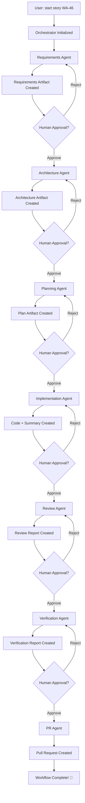

# Agentic SDLC Framework - Quick Summary

## 🎯 What Is It?

An **automated, human-in-the-loop software delivery framework** that transforms Jira stories into production-ready code through **7 specialized AI agents** coordinated by a master orchestrator. Each stage has mandatory human approval gates for quality control.

---

## 🏗️ Architecture

```
┌─────────────────────────────────────────────────────────────┐
│                    SDLC ORCHESTRATOR                         │
│            (Master Controller & State Manager)               │
└────────────┬────────────────────────────────────────────────┘
             │
    ┌────────┴────────┬────────┬────────┬────────┬────────┐
    ▼                 ▼        ▼        ▼        ▼        ▼
┌─────────┐  ┌──────────┐ ┌─────────┐ ┌─────────┐ ┌─────────┐
│ Stage 1 │  │ Stage 2  │ │Stage 3  │ │Stage 4  │ │Stage 5  │
│Require- │  │Architect-│ │Planning │ │Implement│ │Review   │
│ments    │  │ure       │ │         │ │         │ │         │
└────┬────┘  └────┬─────┘ └────┬────┘ └────┬────┘ └────┬────┘
     │            │            │            │            │
     ▼            ▼            ▼            ▼            ▼
 [APPROVE]    [APPROVE]   [APPROVE]   [APPROVE]   [APPROVE]
     │            │            │            │            │
     └────────────┴────────────┴────────────┴────────────┘
                                │
                    ┌───────────┴───────────┐
                    ▼                       ▼
                ┌─────────┐          ┌──────────┐
                │Stage 6  │          │ Stage 7  │
                │Verify   │          │ PR       │
                └────┬────┘          └────┬─────┘
                     │                    │
                     ▼                    ▼
                 [APPROVE]           [CREATE PR]
```

---

## 📋 The 7 Stages & Agents

### 1️⃣ **Requirements Agent**
**Input**: Jira Story ID (e.g., WA-46)  
**Does**:
- Fetches story from Jira via `jira-integrator` skill
- Extracts business, functional, non-functional requirements
- Identifies assumptions & open questions
- Creates acceptance criteria (Given-When-Then format)

**Output**: `.artifacts/WA-46-requirements.md`  
**Gate**: Human reviews & approves requirements

---

### 2️⃣ **Architecture Agent**
**Input**: Requirements artifact  
**Does**:
- Analyzes existing codebase
- Designs component architecture
- Defines interfaces and data models
- Identifies risks and technical constraints

**Output**: `.artifacts/WA-46-architecture.md`  
**Gate**: Human reviews & approves architecture

---

### 3️⃣ **Planning Agent**
**Input**: Requirements + Architecture artifacts  
**Does**:
- Breaks work into atomic tasks
- Estimates effort (T-shirt sizes)
- Identifies dependencies
- Sequences tasks for optimal flow

**Output**: `.artifacts/WA-46-implementation-plan.md`  
**Gate**: Human reviews & approves plan

---

### 4️⃣ **Implementation Agent**
**Input**: Requirements + Architecture + Plan artifacts  
**Does**:
- Creates/updates code files
- Follows repository conventions
- Implements all planned tasks
- Generates unit tests

**Output**: 
- Code changes in repository
- `.artifacts/WA-46-implementation-summary.md`

**Gate**: Human reviews code & approves

---

### 5️⃣ **Review Agent**
**Input**: Implementation summary + code changes  
**Does**:
- Reviews code quality & standards
- Checks test coverage
- Validates architecture compliance
- Identifies security issues

**Output**: `.artifacts/WA-46-review-report.md`  
**Gate**: Human reviews findings & approves

---

### 6️⃣ **Verification Agent**
**Input**: Review report + implementation  
**Does**:
- Verifies acceptance criteria met
- Runs test suites
- Validates requirements coverage
- Checks review findings addressed

**Output**: `.artifacts/WA-46-verification-report.md`  
**Gate**: Human verifies & approves

---

### 7️⃣ **PR Agent**
**Input**: All previous artifacts  
**Does**:
- Generates PR title & description
- Creates changelog
- Builds reviewer checklist
- Summarizes testing evidence
- Creates PR via `github-integrator` skill

**Output**: 
- `.artifacts/WA-46-pr-package.md`
- Pull request on GitHub

---

## 🔄 Workflow Flow



---

## 🛠️ Supporting Skills (Reusable Components)

### Core Skills:
1. **jira-integrator** - Fetch/update Jira issues, search JQL, add comments
2. **github-integrator** - Create PRs, manage issues, check CI status
3. **code-generator** - Generate functions, classes, endpoints with best practices
4. **test-generator** - Generate unit, integration, functional tests
5. **artifact-validator** - Validate stage outputs for completeness
6. **approval-gate-handler** - Manage human approval workflows
7. **audit-logger** - Maintain complete audit trail for compliance
8. **agent-coordinator** - Invoke agents, handle timeouts, retry logic
9. **workflow-state-manager** - Persist and manage workflow state

---

## 📁 File Structure

```
.artifacts/
├── WA-46-requirements.md           # Stage 1 output
├── WA-46-architecture.md           # Stage 2 output
├── WA-46-implementation-plan.md    # Stage 3 output
├── WA-46-implementation-summary.md # Stage 4 output
├── WA-46-review-report.md          # Stage 5 output
├── WA-46-verification-report.md    # Stage 6 output
└── WA-46-pr-package.md             # Stage 7 output

.workflow/
└── WA-46-state.json                # Workflow state & tracking

.audit/
└── WA-46-audit.log                 # Complete audit trail

.claude/
├── agents/                         # 7 specialized agents
│   ├── requirements-agent.md
│   ├── architecture-agent.md
│   ├── planning-agent.md
│   ├── implementation-agent.md
│   ├── review-agent.md
│   ├── verification-agent.md
│   └── pr-agent.md
├── skills/                         # 9+ reusable skills
│   ├── jira-integrator.md
│   ├── github-integrator.md
│   └── ...
├── commands/                       # User commands
│   ├── start-story.md
│   ├── approve.md
│   ├── reject.md
│   └── status.md
└── workflows/
    └── agentic-sdlc.md             # Workflow definition
```

---

## 💬 User Commands

### Start a Story
```bash
start story WA-46
```
Initializes workflow, fetches Jira story, runs Requirements Agent.

### Approve Current Stage
```bash
approve
# or
approve requirements
```
Approves current stage, advances to next agent.

### Reject Current Stage
```bash
reject
# or
reject architecture
```
Stays at current stage, allows fixes before re-approval.

### Check Status
```bash
status
# or
workflow status
```
Shows current progress, stage, approved stages.

---

## 🎯 Key Features

### ✅ Human-in-the-Loop
- **Mandatory approval gates** between every stage
- Reject & fix capabilities at any point
- Full transparency of AI decisions

### ✅ Audit Trail
- Every action logged with timestamp
- Agent invocations tracked
- Approvals/rejections recorded
- Compliance-ready documentation

### ✅ State Management
- Workflow state persisted to disk
- Resume from any point
- Track progress across sessions

### ✅ Modularity
- Specialized agents for each concern
- Reusable skills shared across agents
- Easy to extend or customize

### ✅ Integration
- **Jira**: Fetch stories, update status, add comments
- **GitHub**: Create PRs, manage issues, check CI
- **Local Git**: Branch management, commits, diffs

### ✅ Quality Gates
- Requirements validation
- Architecture review
- Code quality checks
- Test coverage verification
- Acceptance criteria validation

---

## 🔧 Technology Stack

- **Orchestration**: Claude Code Agent Framework
- **Language**: Markdown (agent definitions), Bash (scripts)
- **Version Control**: Git
- **Issue Tracking**: Jira REST API v3
- **Repository**: GitHub (via MCP or gh CLI)
- **State**: JSON files (workflow state, audit logs)
- **Artifacts**: Markdown documents

---

## 📊 Example Workflow Execution

```bash
# Terminal Session

> start story WA-46

✓ Fetching Jira story WA-46...
✓ Story: "Get Weather Data by City Name"
✓ Initializing workflow...
✓ Invoking Requirements Agent...

━━━ Requirements Agent ━━━
- Fetched story from Jira
- Extracted business requirements
- Defined acceptance criteria
- Created artifact: .artifacts/WA-46-requirements.md

📄 Artifact Summary:
   Business Objectives: 2
   Functional Requirements: 5
   Non-Functional Requirements: 3
   Acceptance Criteria: 4

⏸  Approval Gate: Requirements
   Ready to proceed to Architecture stage?

> approve

✓ Requirements approved
✓ Advancing to Architecture stage...
✓ Invoking Architecture Agent...

━━━ Architecture Agent ━━━
- Analyzed existing codebase
- Designed REST endpoint pattern
- Defined component interfaces
- Created artifact: .artifacts/WA-46-architecture.md

📄 Artifact Summary:
   Components: 3
   Interfaces: 2
   Dependencies: 4
   Risks: 2 (Mitigated)

⏸  Approval Gate: Architecture
   Ready to proceed to Planning stage?

> approve

[continues through all 7 stages...]

🎉 Workflow Complete!
   Pull Request: https://github.com/user/repo/pull/123
   Branch: feature/WA-46-weather-endpoint
   Artifacts: .artifacts/WA-46-*.md
```

---

## 🚀 Benefits

### For Engineers
- **Reduces boilerplate work** (requirements docs, architecture diagrams, test generation)
- **Enforces best practices** (code quality, test coverage, security)
- **Maintains consistency** (follows existing patterns)
- **Saves time** (automated artifact generation)

### For Teams
- **Better documentation** (every story has complete artifacts)
- **Quality control** (approval gates at each stage)
- **Knowledge sharing** (artifacts readable by all)
- **Onboarding** (clear process, reproducible)

### For Compliance
- **Complete audit trail** (every action logged)
- **Traceability** (Jira story → code → PR)
- **Approval evidence** (who approved what, when)
- **Change documentation** (why decisions were made)

---

## 🎨 Customization Points

1. **Add/Remove Stages** - Modify workflow definition
2. **Customize Agents** - Edit agent prompts and logic
3. **Add Skills** - Create new reusable components
4. **Change Approval Logic** - Modify approval gate behavior
5. **Integrate Other Tools** - Add Confluence, Slack, etc.
6. **Custom Artifacts** - Define new output formats

---

## 📚 Further Reading

- **Workflow Definition**: `.claude/workflows/agentic-sdlc.md`
- **Orchestrator**: `.claude/agents/sdlc-orchestrator.md`
- **Individual Agents**: `.claude/agents/`
- **Skills Reference**: `.claude/skills/README.md`
- **Commands**: `.claude/commands/`

---

**Version**: 1.0  
**Last Updated**: 2026-05-31  
**Project**: Weather App (WA)  
**Framework**: Agentic SDLC with Human-in-the-Loop
